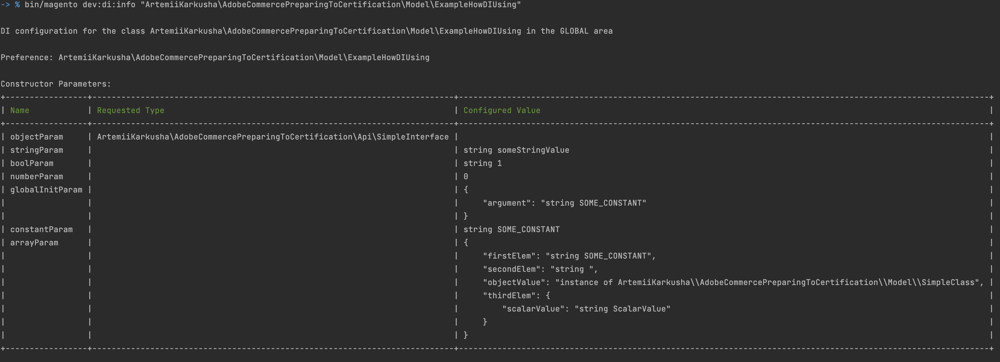
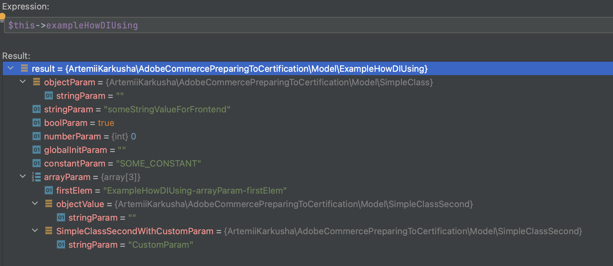
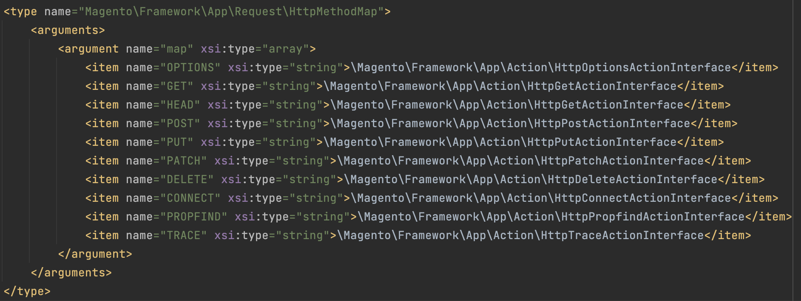
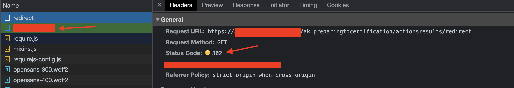
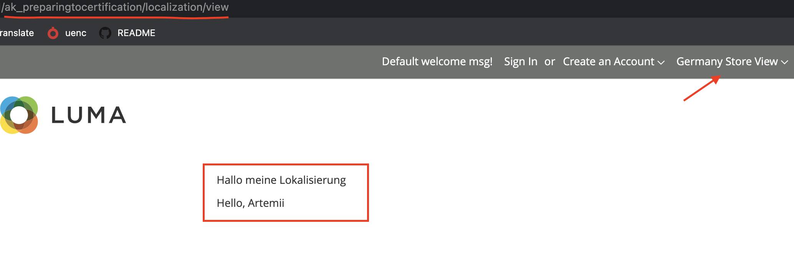
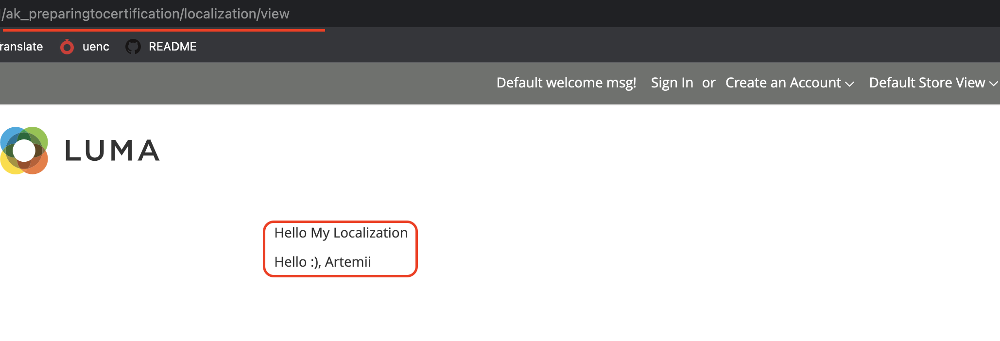
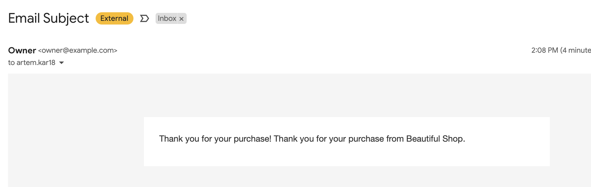

# Preparation To Certification the AD0-E717 (Adobe Commerce Professional)


## General Information


> Code examples are based on questions from certification the [Adobe Certified Professional - Adobe Commerce Developer with Cloud Add-on](https://express.adobe.com/page/N9ImQqutQZ4eO/).

**Author is [Artemii Karkusha](https://www.linkedin.com/in/artemiy-karkusha/).**
Please, left a star if was helpful for you. Thank you. 

## Exam Objectives and Scope. Topics. 


### Section 1: Working with Admin (5.2%)

 1. Describe how the ACL works with roles and resources.   
 - Code examples:  
   - [acl.xml](etc/acl.xml?plain=1#L9)  
   - [menu.xml](etc/adminhtml/menu.xml?plain=1#L13)  
   - [Controller](Controller/Adminhtml/View/Index.php?plain=1#L19)  
   - [Block Restrictions](view/adminhtml/layout/preparingtocertification_view_index.xml?plain=1#L13)    
   - [Restrict web API access](etc/webapi.xml?plain=1#L11)  
   - [Ui component Restrictions](view/adminhtml/ui_component/delivery_service_listing.xml?plain=1#L33)  
   - [system.xml restriction](etc/adminhtml/system.xml?plain=1#L14)  
 - Adobe docs:  
   - [Create an access control list (ACL) rule](https://developer.adobe.com/commerce/php/tutorials/backend/create-access-control-list-rule/#step-1-define-the-custom-resources)
 2. Identify the components to use when creating or modifying the admin grid/form  
 - Code examples:  
   - [Create layout with ui_component](view/adminhtml/layout/delivery_service_deliveryservice_index.xml?plain=1#L8)  
   - [Create ui_component the listing](view/adminhtml/ui_component/delivery_service_listing.xml?plain=1#L7)  
   - [Create ui_component the form](view/adminhtml/ui_component/delivery_service_form.xml?plain=1#L6)  
 - Adobe docs:  
   - [Introduction to UI components](https://developer.adobe.com/commerce/frontend-core/ui-components/)  
   - [Form component](https://developer.adobe.com/commerce/frontend-core/ui-components/components/form/)  
   - [Listing (grid) component](https://developer.adobe.com/commerce/frontend-core/ui-components/components/listing-grid/)  
   - [Add an Admin grid](https://developer.adobe.com/commerce/php/development/components/add-admin-grid/)

 3. Identify the files to use when creating a store/admin config and menu items
 - Code examples:  
   - [system.xml](etc/adminhtml/system.xml)  
   - [menu.xml](etc/adminhtml/menu.xml)  
   - [dependsOnConfig](etc/adminhtml/menu.xml?plain=1#L29) *It is very helpful attribute which helps to control visibility of menu item with config.*  
 - Adobe docs
   - [system.xml](https://experienceleague.adobe.com/docs/commerce-operations/configuration-guide/files/config-reference-systemxml.html)

### Section 2: Architecture (28.6%)

 1. Describe Magento file structure  
 - Docs:  
   - [File structures of Module, Theme, Language package](https://developer.adobe.com/commerce/php/development/build/component-file-structure/)  
   - [Magento 2 Folder Structure](https://meetanshi.com/blog/magento-2-folder-structure/)
 2. Describe Magento CLI commands  
 - Code examples:
   - [Example console command](Console/Command/DeliveryService/Create.php)
   - [di.xml](etc/di.xml?plain=1#L13)
   ```sh
   bin/magento preparingToCertification:deliveryService:create --example_required_option=123 --example_none_option
   ```
 - Docs:
   - [Command-line tool](https://experienceleague.adobe.com/docs/commerce-operations/configuration-guide/cli/config-cli.html?lang=en)
   - [Command naming guidelines](https://developer.adobe.com/commerce/php/development/cli-commands/naming-guidelines/)
   - [Create a custom command](https://developer.adobe.com/commerce/php/development/cli-commands/custom/)
   - [Common commands](https://experienceleague.adobe.com/docs/commerce-operations/configuration-guide/cli/common-cli-commands.html?lang=en)
 3. Describe cron functionality  
 - Code examples:
   - [Cron jobs with static and flexible scheduled time](etc/crontab.xml?plain=1#L7)
   - [cron_groups.xml](etc/cron_groups.xml)
 - Docs:
   - [Configure cron jobs](https://experienceleague.adobe.com/docs/commerce-operations/configuration-guide/cli/configure-cron-jobs.html) 
   - [Magento 2 Cron Job: How to Create, Set up, and Configure It in Easy Steps](https://www.cloudways.com/blog/setup-magento-cron-job/)
   - [Disable a cron job](https://experienceleague.adobe.com/docs/commerce-operations/configuration-guide/crons/custom-cron-reference.html?lang=en#disable-a-cron-job)
 4. Given a scenario, describe usage of the di.xml  
 - Code examples:
   - [etc/di.xml - Argument types](etc/di.xml?plain=1#L23) 
   - DI in GLOBAL area
   
   - [Virtual Type](etc/frontend/di.xml?plain=1#L8)
   - [Override arguments for Frontend Area](etc/frontend/di.xml?plain=1#L17)
   - DI in FRONTEND area
   
   - [Sensitive and system-specific configuration settings](etc/di.xml?plain=1#L58)
  - Docs:
    - [Dependency injection](https://developer.adobe.com/commerce/php/development/components/dependency-injection/) 
    - [Code Complier](https://experienceleague.adobe.com/docs/commerce-operations/configuration-guide/cli/code-compiler.html)
    - [Dependency injection configuration](https://developer.adobe.com/commerce/php/development/build/dependency-injection-file/#areas-and-application-entry-points)
    - [Sensitive and system-specific configuration settings](https://developer.adobe.com/commerce/php/development/configuration/sensitive-environment-settings/#how-to-specify-values-as-sensitive-or-system-specific)
 5. Given a scenario, create controllers  
 - Code examples:
   - [Create a custom router (di.xml)](etc/di.xml?plain=1#L71)
   - [Create a custom router (Router)](Controller/CustomRouter.php)
   - [Create a controller in admin area (Page)](Controller/Adminhtml/View/Index.php)
   - [Create a controller in frontend area (Magento\Framework\Controller\Result\Raw)](Controller/Di/Example.php)
   - Action classes:
   
   - Result objects:
     - [Json](Controller/ActionsResults/Json.php)
     - [Raw](Controller/ActionsResults/Raw.php)
     - [Redirect](Controller/ActionsResults/Redirect.php) - redirects to another page using http status 302 (visible redirect)
       
     - [Forward](Controller/ActionsResults/Forward.php) - does not trigger a new request from the browser. The URL stays the same
     - [Layout](Controller/ActionsResults/Layout.php)
       - [Create a new Page Type](etc/frontend/page_types.xml) 
       - [Create layout for the page](view/frontend/layout/example_result_layout_page.xml)
     - [Page](Controller/ActionsResults/Page.php)
       - [Layout](view/frontend/layout/ak_preparingtocertification_actionsresults_page.xml)
       - [Template](view/frontend/templates/actionsresults/page.phtml)
 - Docs:
   - [Routing](https://developer.adobe.com/commerce/php/development/components/routing/)
 6. Describe module structure  
 - Docs:
   - [Module file structure](https://developer.adobe.com/commerce/php/development/build/component-file-structure/#module-file-structure) 
 7. Describe index functionality
 - Code examples:
   - [Create indexer](etc/indexer.xml)
   - [Create mview config](etc/mview.xml)
   - [Create Mview class](Model/Indexer/DeliveryService.php)
 - Docs:
   - [Indexing](https://developer.adobe.com/commerce/php/development/components/indexing/) 
   - [Manage the indexers](https://experienceleague.adobe.com/docs/commerce-operations/configuration-guide/cli/manage-indexers.html?lang=en)
   - [Create a custom indexer](https://developer.adobe.com/commerce/php/development/components/indexing/custom-indexer/)
 8. Describe localization  
 - Code examples: 
   - [Rewrite translate from module the module-checkout (i18n)](i18n/en_US.csv?plain=1#L2) 
   - Strings added in .phtml templates:
     - Add translate for stable phrase:
       - [Outputting a string](view/frontend/templates/localization/view.phtml?plain=1#L18)
       - [Rewrite translate for en_US](i18n/en_US.csv?plain=1#L3)
       - [Rewrite translate for de_DE](i18n/de_DE.csv?plain=1#L1)
     - Add translate for phrase with a variable:
       - [Outputting a string](view/frontend/templates/localization/view.phtml?plain=1#L20)
       - [Rewrite translate for en_US](i18n/en_US.csv?plain=1#L4)
       - [Rewrite translate for de_DE](i18n/de_DE.csv?plain=1#L2)  
     - Final result for en_US: `ak_preparingtocertification/localization/view`  
      
     - Final result for de_DE: `ak_preparingtocertification/localization/view`  
     
   - Strings added in email templates:
     - Create email template:
       - [Create email_templates.xml](etc/email_templates.xml?plain=1#L6)
       - [Create email_example.html](view/frontend/email/email_example.html)
     - Add translate for stable phrase:
         - [Outputting a string](view/frontend/email/email_example.html?plain=1#L8)
         - [Rewrite translate for en_US](i18n/en_US.csv?plain=1#L5)
         - [Rewrite translate for de_DE](i18n/de_DE.csv?plain=1#L3) 
     - Add translate for phrase with a variable:
         - [Outputting a string](view/frontend/email/email_example.html?plain=1#L9)
         - [Rewrite translate for en_US](i18n/en_US.csv?plain=1#L6)
         - [Rewrite translate for de_DE](i18n/de_DE.csv?plain=1#L4)
     
     ```sh
     bin/magento preparingToCertification:email:send --template_identifier=email_example --send_to_email="your.email@gmail.com" --store_code=default
     ```
     - Final result email for en_US:
     
     - Final result email for en_US:
     
   - Docs:
     - [Translations](https://developer.adobe.com/commerce/frontend-core/guide/translations/)
     - [Theme strings](https://developer.adobe.com/commerce/frontend-core/guide/translations/theory/)
     - [Email Localization](https://developer.adobe.com/commerce/frontend-core/guide/templates/email/)
 9. Describe plugin, preference, event observers, and interceptors  
 10. Describe custom module routes  
 11. Describe URL rewrites  
 12. Describe the Magento caching system  
 13. Describe stores, websites, and store views (basic understanding)  

### Section 3: EAV/Database(13.0%)

 1. Given a scenario, change/add/remove attribute sets and/or attributes  
 2. Describe different types of attributes  
 3. Given a scenario, use a DB schema to alter a database table  
 4. Describe models, resource models, and collections  
 5. Describe basics of Entity Attribute Value (EAV)  

### Section 4: Layout/UI (14.3%)

 1. Apply changes to existing product types and create new ones  
 2. Modify and extend existing Catalog entities  
 3. Demonstrate the ability to manage Indexes and customize price output  
 4. Explain how multi-source inventory impacts stock (program level)  

### Section 5: Checkout and Sales (7.8%)

 1. Describe cart components  
 2. Describe a cart promo rule  
 3. Given a scenario, describe basic checkout modifications  
 4. Given a scenario, describe basic usage of quote data  
 5. Given a scenario, configure the payment and shipping methods  
 6. Given a scenario, configure tax rules, currencies, cart, and/or checkout  

### Section 6: Catalog (7.8%)

 1. Identify the basics of category management and products management  
 2. Describe product types  
 3. Describe price rules  
 4. Describe price types  

### Section 7: Adobe Commerce Cloud architecture (11.7%)

 1. Define Adobe Commerce architecture/environment workflow  
 2. Describe cloud project files, permission, and structure  
 3. List services available on Adobe Commerce on Cloud  
 4. Describe how to access different types of logs  
 5. Describe steps for applying patches (Identify which folder to put patches in)  
 6. Describe how to Maintain and upgrade ECE tools  
 7. Identify when to call support *Yaml files and limitations (DIY vs Support tickets)  

### Section 8: Setup/Configuring Adobe Commerce Cloud (3.9%)

 1. Identify how to setup/configure Adobe Commerce Cloud  
 2. Define Basic Cloud troubleshooting (Hierarchy of web UI and variables, configurations precedence)  
 3. Recognize basic knowledge of cloud user management and onboarding UI  
 4. Describe environment Management using UI  
 5. Describe branching using UI  
 6. Identify Adobe commerce Cloud Plan capabilities  

### Section 9: Commerce Cloud CLI tool (Managing part) (6%)

 1. Describe exclusive features of Adobe Commerce Cloud CLI tool (CLI exclusive features: activate emails, rebase environments, snapshot, db dump, local environment setup)  
 2. Describe branching using the Adobe Commerce Cloud CLI tool  
 3. Identify ways to connect to cloud services? (My SQL, Redis, tunnel:info)  


